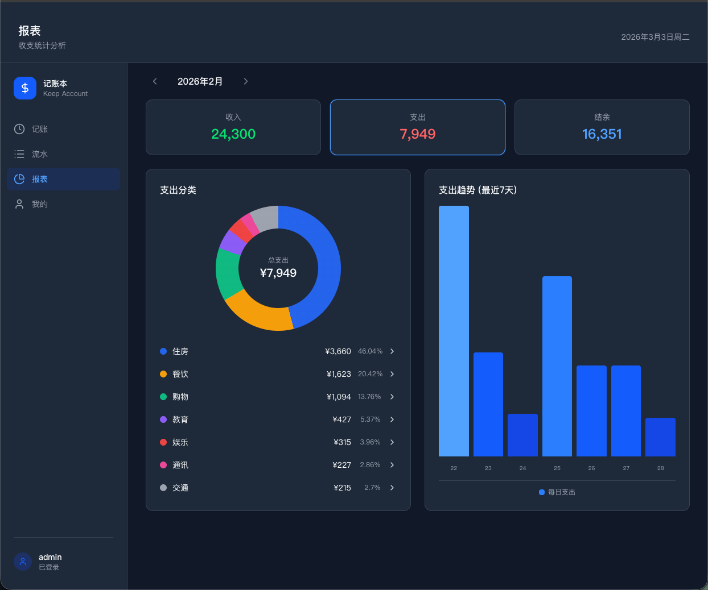
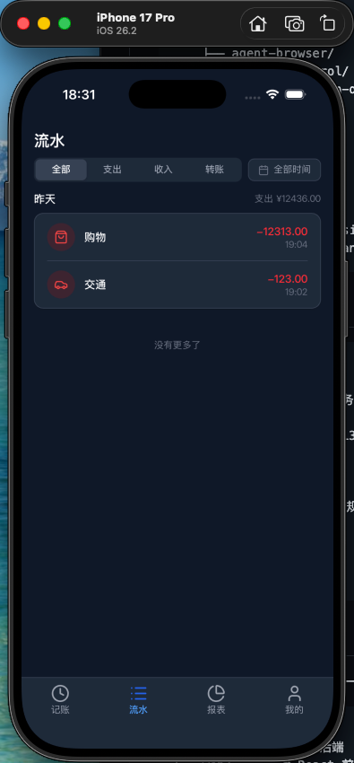

# Keep Account (记账本)

多端云同步记账应用 —— 3 秒完成一笔记账，清晰掌握每一分钱的去向。

## 概述

Keep Account 是一款面向个人的极简记账应用，主打"快速录入 + 美观报表"。支持 Web、iOS、Android 和桌面端，数据通过云端自动同步。

## 核心功能

- **3 秒记账** — 输入金额 → 选择分类 → 保存，极简操作路径
- **三种类型** — 支出、收入、转账全覆盖
- **财务报表** — 月度总览、分类占比饼图、趋势折线图、分类下钻
- **分类管理** — 系统预设 + 用户自定义分类
- **多端同步** — Web / iOS / Android / Desktop，一个账号数据同步
- **明暗主题** — 浅色 / 深色模式自由切换

## 应用截图

### 桌面端 — 财务报表



月度收支总览、分类占比饼图、支出趋势柱状图，深色主题。

### iOS 端 — 流水列表



iPhone 17 Pro 上的流水列表页面，支持按类型筛选和时间过滤。

## 技术栈

| 层级 | 技术 |
|------|------|
| 后端 | Go 1.25, Gin, GORM, SQLite, JWT, Viper, Zap |
| 前端 | React 19, TypeScript, Vite 7, Tailwind CSS 4, Zustand |
| 桌面/移动端 | Tauri 2 (Rust) |
| 部署 | Docker, Nginx |

## 目录结构

```
keep-account/
├── server/                # Go 后端
│   ├── cmd/server/       # 入口
│   ├── internal/
│   │   ├── config/       # 配置与日志
│   │   ├── handler/      # HTTP 请求处理
│   │   ├── middleware/    # CORS, JWT, 日志中间件
│   │   ├── model/        # 数据模型 (User, Category, Transaction)
│   │   ├── router/       # 路由定义
│   │   └── service/      # 业务逻辑
│   └── pkg/response/     # 统一响应格式
├── web/                   # React 前端
│   ├── src/
│   │   ├── pages/        # 页面组件
│   │   ├── components/   # 可复用组件
│   │   ├── stores/       # Zustand 状态管理
│   │   └── lib/          # 工具库 (axios 封装)
│   └── src-tauri/        # Tauri 桌面/移动端配置
├── deploy/                # Docker 部署配置
└── docs/                  # 项目文档 (需求/设计/测试)
```

## API 接口

基础路径: `/api/v1`

| 方法 | 路径 | 说明 |
|------|------|------|
| POST | /auth/register | 用户注册 |
| POST | /auth/login | 用户登录 |
| POST | /auth/logout | 退出登录 |
| GET | /user/profile | 获取用户信息 |
| GET | /categories | 获取分类列表 |
| POST | /categories | 创建自定义分类 |
| DELETE | /categories/:id | 删除分类 |
| GET | /transactions | 流水列表 (支持筛选) |
| POST | /transactions | 新增记账 |
| GET | /transactions/:id | 流水详情 |
| PUT | /transactions/:id | 编辑流水 |
| DELETE | /transactions/:id | 删除流水 |
| GET | /reports/monthly-summary | 月度收支总览 |
| GET | /reports/category-breakdown | 分类占比 |
| GET | /reports/trend | 趋势分析 |

## 快速开始

### 后端

```bash
cd server
go run cmd/server/main.go
# 服务运行在 http://localhost:5723
```

### 前端

```bash
cd web
npm install
npm run dev
# 开发服务器运行在 http://localhost:5173
```

### Tauri 桌面端

```bash
cd web
npm run tauri:dev
```

### iOS

```bash
cd web
npm run tauri:ios-dev
```

### Docker 部署

```bash
cd deploy
docker compose up -d
```

## 开发框架

本项目使用 [HZ-Agents](https://github.com/LucaHhx/hz-agents) 多智能体框架全流程开发，6 个 AI Agent（PM、Tech Lead、前端、后端、UI 设计师、QA）协作完成从需求到测试的完整交付。

详细使用指南请查看 **[docs/hz-agents-guide.md](docs/hz-agents-guide.md)**，内容包括：

- 系统架构与环境搭建
- 六大 Agent 角色详解（职责、权限、工作流）
- 四大命令使用指南（`/doc-review`、`/dev-team`、`/qa-test`、`/fix`）
- 18 个 Skills 能力模块详解
- 实战：从零构建 Keep Account 的完整步骤
- 三层文档体系与 `docs.py` CLI 工具
- 质量门禁机制
- Keep Account 8 个需求迭代 + 13 个 Bug 修复的完整记录

`docs/` 目录记录了整个项目的开发过程，每个需求都包含需求计划、技术设计、UI 设计稿、QA 测试截图：

| 目录 | 内容 |
|------|------|
| `docs/1-account-system/` | 账号系统（注册/登录/JWT 鉴权） |
| `docs/2-quick-bookkeeping/` | 3 秒记账（金额输入/分类选择） |
| `docs/3-transaction-list/` | 流水管理（筛选/编辑/删除） |
| `docs/4-data-reports/` | 数据报表（月度总览/饼图/趋势图） |
| `docs/5-cloud-sync/` | 云同步与主题切换 |
| `docs/6-multi-platform/` | 多端构建（桌面/iOS/Android） |
| `docs/7-deploy-process/` | Docker 部署流程 |
| `docs/8-server-info-display/` | 服务信息展示 |
| `docs/fixes/` | 13 个 Bug 修复记录 |

## 配置

后端配置文件: `server/config.yaml`

```yaml
server:
  port: 5723
database:
  path: "./data/keep-account.db"
jwt:
  secret: "change-me-in-production"
  expire_days: 7
```

## 许可证

Private
